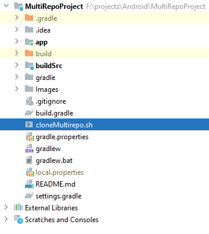

<h1 align="center">MultiRepoProject</h1> 

<h5>
In this project , we will see how we can use shell script to clone a multiple GitHub repository single Android project.This demo contains shell script and simple hello word project which clones other git repo's
</h5>

  
## About Shell script **cloneMultirepo.sh**
  * You add your own repo url's in repo1, repo2... variables as mentioned below
    * repo1="https://github.com/androcreator/ReusableComponents.git"
    * repo2="https://github.com/androcreator/ShowHidePasswordView.git"

  
  * You can update the branch branch name for each repo that you want to point to as mentioned below
  
    * declare -a repolist=("repo1::"$repo1"@@development" "repo2::"$repo2"@@release"). In this line we mention branch name with @@ notation, You can update this accourding to your need.
 
## How to build?
  * Clone this [repo](https://github.com/androcreator/MultiRepoProject.git) in to your Local machine.
  * You will see the below Project structure.

  * You will see Shell script named **cloneMultirepo.sh**
  
  * Run the cloneMultirepo.sh inside your project where you need this dependies.
  * Once the script execution is completed you well see all you dependencies are cloned.
  * Finally you can just build and hit run button to build your project.

## Advantage
  * We can us shell script accross platform like Android, iOS, Java, Server side. This solution suites for bigger projects that is follows multi repo concept. It helps developers to maintain single script accross platform

